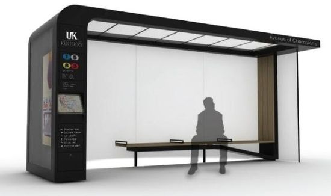
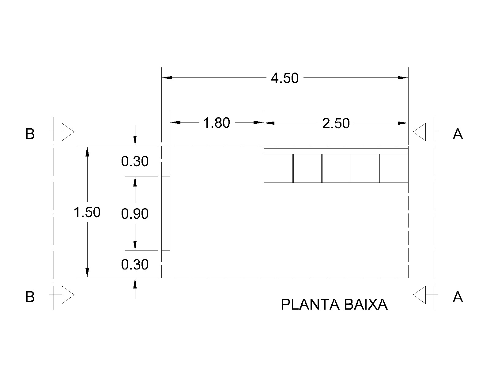
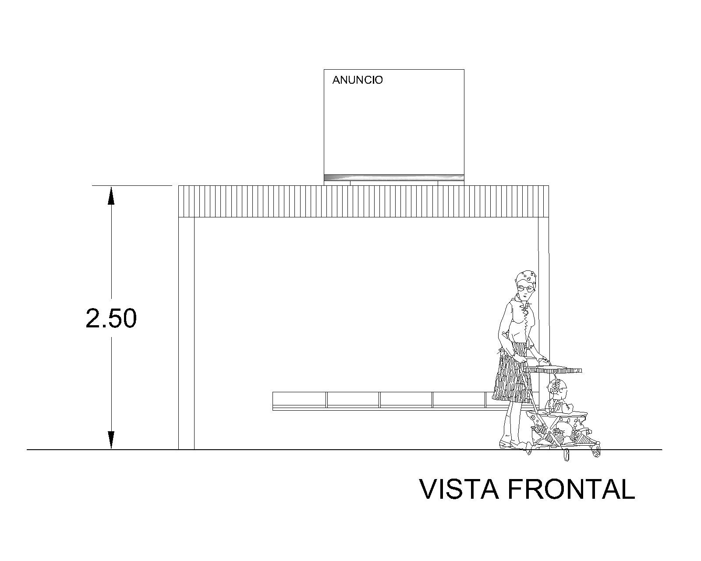

<!--Don't delete this script-->

<!--Don't delete this script-->

<h1>Definindo as características do projeto executivo</h1>

 
Com base nas informações apresentadas durante a aula e nas imagens fornecidas pelo professor por meio do aplicativo Pinterest, desenvolvemos a arquitetura padrão para o ponto de ônibus. De acordo com as diretrizes estabelecidas anteriormente, nosso abrigo terá as seguintes especificações:

 

<ol>
  <li>
    
<b>Dimensões:</b> O abrigo terá dimensões de 1,50 metros de largura por 4,50 metros de comprimento. Essas dimensões foram cuidadosamente escolhidas para acomodar um número razoável de passageiros com conforto e manter um tamanho adequado para a instalação em locais urbanos.

  </li>
  <li>
    
<b>Estrutura:</b> A estrutura do ponto de ônibus será construída com materiais resistentes e duráveis, como aço e concreto. Essa escolha garantirá a estabilidade e a longevidade da estrutura, suportando as condições climáticas e o uso constante pelos passageiros. No caso a cobertura será em estrutura metálica, pilares vigas e fundações será em concreto armado.
 
  </li>
  <li>
    
<b>Cobertura:</b> O abrigo contará com uma cobertura que protegerá os passageiros da chuva e do sol. Essa cobertura será inclinada em 5% para evitar o acúmulo de água da chuva e permitir o escoamento adequado.

  </li>
  <li> 
    
<b><i>Design</i>:</b> O <i>design</i> pensado para o projeto não será afetado pela proposta estrutural. Logo nenhuma observação será feita a respeito de interferências estruturais na arquitetura.

  </li>
</ol>

O <i>layout</i> arquitetônico é apresentado na Figura <a href="#fig1">(1)</a>:

 

<table border = "0" style = "width:100%">
  <tr>
    <td>

</td>
  </tr>
  <tr>
    <td>

<b>Figura 1.</b> Proposta de arquitetura.

</td>
  </tr>
</table>

<h1>Processo executivo arquitetônico</h1>

 
Deste modo, foi iniciada a execução do projeto arquitetônico, ver Figura <a href="#fig2">(2)</a> e <a href="#fig3">(3)</a>, do ponto de ônibus com o auxílio da ferramenta AutoCAD, visando alcançar uma compreensão mais abrangente e detalhada da estrutura, o que nos permitiu estabelecer uma base sólida para o dimensionamento do projeto.

 

<table border = "0" style = "width:100%">
  <tr>
    <td>

</td>
  </tr>
  <tr>
    <td>

<b>Figura 2.</b> Planta baixa.

</td>
  </tr>
  <tr>
    <td>

</td>
  </tr>
  <tr>
    <td>

<b>Figura 2.</b> Vista frontal.

</td>
  </tr>
</table>