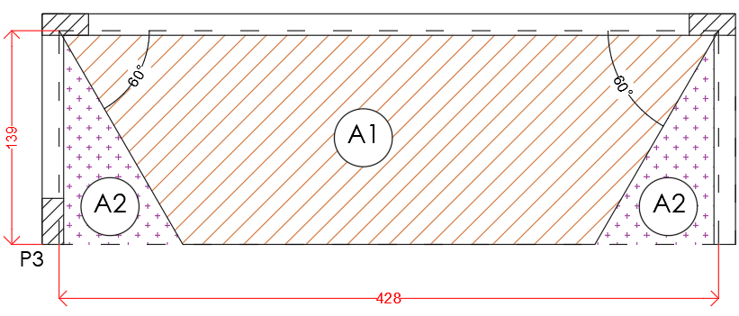

<!--Don't delete this script-->

<!--Don't delete this script-->

O carregamento será determinado conforme prescrição da ABNT NBR 6120 [2]. O memorial descreve que a cobertura será impermeabilizada. Portanto as cargas atuantes nessa estrutura podem ser descritas da seguinte forma:

<ul>
<li>
Carga permanente: Peso próprio da estrutura, fechamento em vidro, fechamento em alvenaria, impermeabilização da cobertura;
</li>
<li>
Carga variável da cobertura.
</li>
</ul>

<h1>Carga na laje</h1> 

A carga que atua na laje LC1 será divida entre carregamento permanente e variável. O peso próprio da laje é obtido através da multiplicação do peso específico do concreto e a altura da laje, a qual tem o valor de 0,10 m. Logo o valor deste carregamento é gpp = 0,10 x 25 = 2,50 kN/m².
  
Consultando a tabela 4 da ABNT NBR 6120 [2] adotou-se como carga permanente extra o valor de 1,80 kN/m² (gext). Este valor é devido a manta asfáltica descrita nas especificações arquitetônicas.
  
Logo a carga permanente total é dada por:

<table border = "0" style = "width:100%">
    <tr>
        <td>\[ g = g_{pp} + g_{ext} = 2,50+1,80=4,30 \]</td>
    </tr>
</table>

A carga variável selecionada para esse projeto é de 1,5 kN/m² considerando a possibilidade de instalação de placas fotovoltaicas.

<h1>Carga nas vigas</h1> 

O carregamento nas vigas superiores é dependente das reações da laje LC1 nas vigas VC1, VC2 e VC3. Já as vigas do térreo suportam cargas de alvenarias de vedação rebocada e o fechamento em vidro temperado. Nesta seção serão apresentadas os carregamentos referentes das vigas do pavimento cobertura.

<h3>Reação da LC1 nas vigas da cobertura</h3> 

Como dito anteriormente a laje LC1 suportará uma carga permanente de 4,30 kN/m² e uma carga variável de 1,50 kN/m². Para determinar as reações da laje nas vigas será necessário o uso do método de charneiras plásticas. Porém é necessário discutir o sistema de apoio das lajes nas vigas.
  
No caso deste projeto a laje LC1 fica engastada na viga VC1 visto que está é considerada uma laje unidirecional (λ>2,00). Portanto para evitar a formação de um mecanismo a mesma será considerada engastada em VC1. Logo a partição da carga é apresentada na Figura <a href="#fig1">1</a>.

<table border = "0" style = "width:100%">
  <tr>
    <td>

</td>
  </tr>
  <tr>
    <td>

<b>Figura 1.</b> Charneiras plásticas na LC1.

</td>
  </tr>
</table>

No caso deste projeto o valor da A1 é de 4,83 m² e o valor de A2 é de 0,56 m². Logo é possível determinar a carga devido a reação da laje LC1 em todas as vigas da cobertura conforme Tabela <a href="#tab1">1.</a>

<b>Tabela 1.</b> Carga nas vigas da cobertura.

<table style = "width:100%">
  <thead>
    <tr>
      <th>Viga</th>
      <th>Área de influência (m²)</th>
      <th>Carga (kN/m²)</th>
      <th>Vão (m) de referência</th>
      <th>Carga distribuída laje (kN/m)</th>
      <th>Carga distribuída p.p. (kN/m)</th>
      <th>Carga total (kN/m)</th>
    </tr>
  </thead>
  <tbody>
    <tr>
      <td>VC1</td>
      <td>4,83</td>
      <td>\(g\)= 4,30</td>
      <td>4,28</td>
      <td>\[\frac{4,30 \cdot 4,83}{4,28} = 4,85\]</td>
      <td>\[\ 0,14 \cdot 0,45 \cdot 25 = 1,57\]</td>
      <td>\[4,85 + 1,57 = 6,42\]</td>
    </tr>
    <tr>
      <td>VC1</td>
      <td>4,83</td>
      <td>\(q\)= 1,50</td>
      <td>4,28</td>
      <td>\[\frac{1,50 \cdot 4,83}{4,28} = 1,69\]</td>
      <td>
-
</td>
      <td>\[1,69\]</td>
    </tr>
    <tr>
      <td>VC2=VC3</td>
      <td>0,56</td>
      <td>\(g\)= 4,30</td>
      <td>1,39</td>
      <td>\[\frac{4,30 \cdot 0,56}{1,39} = 1,73\]</td>
      <td>\[\ 0,14 \cdot 0,45 \cdot 25 = 1,57\]</td>
      <td>\[1,73 + 1,57 = 3,30\]</td>
    </tr>
    <tr>
      <td>VC2=VC3</td>
      <td>0,56</td>
      <td>\(q\)= 1,50</td>
      <td>1,39</td>
      <td>\[\frac{1,50 \cdot 0,56}{1,39} = 0,60\]</td>
      <td>
-
</td>
      <td>\[0,60\]</td>
    </tr>
  </tbody>
</table>

<h3>Carregamento nas vigas do térreo</h3>

Considerando que a parede tem 15 cm de espessura foi selecionado neste projeto a alvenaria de vedação 14 cm de espessura e reboco em cada face de 1,00 cm totalizando 1,80 kN/m² (conforme tabela 2 da ABNT NBR 6120 [2]). Para tanto foi considerado uma carga linear de galv = 3,15 kN/m (galv = 1,75 x 1,80 = 3,15) para a viga VT1. Além disso uma das faces da arquitetura exige um fechamento em vidro com espessura de 10 mm (peso específico aparente de 22 kN/m³) e altura média de 1,79 m (média entre 1,75 m e 1,83 m) que totaliza 0,38 kN/m (gvidro = 22 x 0,01 x 1,79 = 0,39 kN/m). A Tabela <a href="#tab2">2</a> resume o carregamento nas vigas do térreo.

<b>Tabela 2.</b> Carga nas vigas do térreo.

<table style = "width:100%">
  <thead>
    <tr>
      <th>Viga</th>
      <th>Carga distribuída vedações (kN/m)</th>
      <th>Carga distribuída p.p. (kN/m)</th>
      <th>Carga total (kN/m)</th>
    </tr>
  </thead>
  <tbody>
    <tr>
      <td>VT1</td>
      <td>3,15</td>
      <td>\[\ 0,14 \cdot 0,45 \cdot 25 = 1,57\]</td>
      <td>\[\ 3,15 + 1,57 = 4,72\]</td>
    </tr>
    <tr>
      <td>VT2</td>
      <td>0,00</td>
      <td>\[\ 0,14 \cdot 0,45 \cdot 25 = 1,57\]</td>
      <td>\[\ 1,57 \]</td>
    </tr>
    <tr>
      <td>VT3</td>
      <td>\[ g_{alv} = 1,79 \cdot 1,80 = 3,22 \]</td>
      <td>\[\ 0,14 \cdot 0,45 \cdot 25 = 1,57 \]</td>
      <td>\[\ 3,22 + 1,57 = 4,79\]</td>
    </tr>
    <tr>
      <td>VT4</td>
      <td>0,39</td>
      <td>\[\ 0,14 \cdot 0,45 \cdot 25 = 1,57\]</td>
      <td>\[\ 0,39 + 1,57 = 1,96\]</td>
    </tr>
  </tbody>
</table>

<h3>Carregamento nos pilares</h3>

Além dos carregamentos advindos das vigas é necessário considerar o peso próprio dos pilares no momento da obtenção dos esforços. Para isso determina-se o gpp_pilares que é igual a 1,05 kN/m (0,14 x 0,30 x 25).

