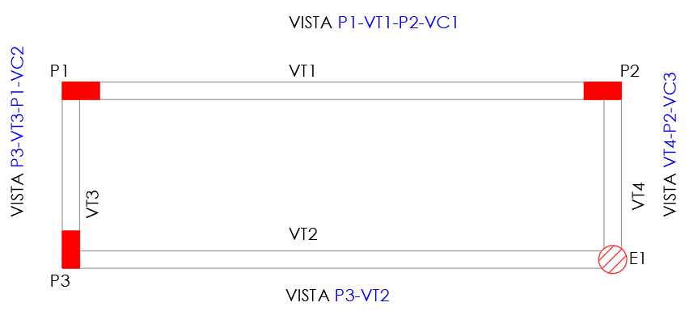

<!--Don't delete this script-->

<!--Don't delete this script-->

Os esforços serão determinados empregando método dos deslocamentos em função dos pórticos apresentados na seção anterior. Para essa determinação foi empregado o <i>software</i> Ftool. A disposição de vistas dos pórticos de concreto é apresentada na Figura <a href="#fig1">1</a>.

<table border = "0" style = "width:100%">
  <tr>
    <td>

</td>
  </tr>
  <tr>
    <td>

<b>Figura 1.</b> Indicação de vistas para determinar os pórticos.

</td>
  </tr>
</table>

Os pórticos no Ftool podem ser baixados a seguir:

<ul>
  <li><a target="_blank" rel="noopener" href="https://github.com/wmpjrufg/FEA0064/blob/gh-pages/portico_p1_vt1_p2_vc1.ftl">Pórtico vista P1-VT1-P2-VC1</a>;</li>
  <li><a target="_blank" rel="noopener" href="https://github.com/wmpjrufg/FEA0064/blob/gh-pages/portico_p3_vt3_p1_vc2.ftl">Pórtico vista P3-VT3-P1-VC2</a>;</li>
  <li><a target="_blank" rel="noopener" href="https://github.com/wmpjrufg/FEA0064/blob/gh-pages/portico_p3_vt2.ftl">Pórtico vista P3-VT2</a>;</li>
  <li><a target="_blank" rel="noopener" href="https://github.com/wmpjrufg/FEA0064/blob/gh-pages/portico_vt4_p2_vc3.ftl">Pórtico vista VT4-P2-VC3</a>.</li>
</ul>

O módulo de elasticidade será considerado para o concreto classe 25 (fck = 25 MPa) e com um agregado de granito com dimensão máxima de 19 mm.

<table border = "0" style = "width:100%">
    <tr>
        <td>\[ E_{ci} = 5600 \cdot \sqrt{25} = 28000 \; MPa = 28 \cdot 10^6 \; kPa \]</td>
    </tr>
    <tr>
        <td>\[ \alpha_i = 0,80 + 0,20 \cdot + \frac{25}{80} = 0,86 \]</td>
    </tr>
    <tr>
        <td>\[ E_{cs} = 0,86 \cdot 28 \cdot 10^6 = 24,08 \cdot 10^6 \; kPa \]</td>
    </tr>
</table>

A seguir são listadas as tabelas de esforços em cada uma das vistas para que seja possível efetuar o dimensionamento da estrutura por completo.

