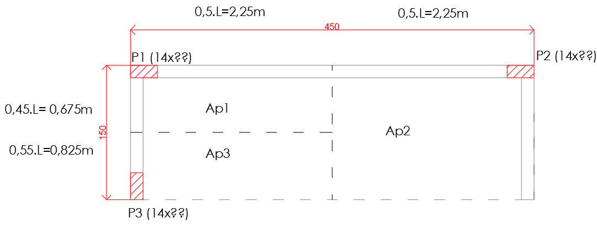

<!--Don't delete this script-->

<!--Don't delete this script-->

<h1>Lançamento de lajes, vigas e pilares</h1> 

O lançamento estrutural seguirá as diretrizes para peças de concreto armado em geral. A seguir serão apresentados os passos para determinação da geometria inicial de cada um dos elementos.  
As Figuras <a href="#fig1">1</a> e <a href="#fig1">2</a> apresentam a plantas de interferência estrutural da proposta inicial de projeto estrutural. Foi considerado um reboco de 0,5 cm em cada uma das faces para que fosse possível inserir as vigas sem nenhum tipo de requadro nos elementos.

<table border = "0" style = "width:100%">
  <tr>
    <td>

</td>
  </tr>
  <tr>
    <td>

<b>Figura 1.</b> Interferência de pilares e vigas no térreo.

</td>
  </tr>
  <tr>
    <td>

</td>
  </tr>
  <tr>
    <td>

<b>Figura 2.</b> Interferência de pilares e vigas na cobertura.

</td>
  </tr>
</table>

<h1>Pré-dimensionamento</h1>  

A etapa de pré-dimensionamento pode ser realizada por qualquer grupo de elementos estruturais e isso irá depender da forma a qual você está mais acostumado. Primeiramente será estabelecida as dimensões das vigas, depois lajes e pilares.

<h3>Pré-dimensionamento das vigas</h3>  

Realizaremos o pré-dimensionamento das vigas do térreo VT1 a VT4 e VC1 a VC3. A largura das vigas será especificada em 14 cm para que seja possível fazer o fechamento da alvenaria sem nenhum tipo de requadro. A excessão será a viga VC1 que terá esforços de torção então será estabelecida com largura de 20 cm.  
Apenas para critério de verificação será aplicado a relação l0 / 50 para verificar a largura mínima (bw,min) conforme o item 15.10 da ABNT NBR 6118 [1]. No caso bw,min = 4,50 / 50 = 0,09 m = 9 cm.
  
Considerando que todas as peças serão biapoiadas a altura das vigas é dada conforme Tabela <a href="#tab1">1</a>.

<b>Tabela 1.</b> Pré-dimensionamento das vigas.

<table border="0" style = "width:100%">
    <tr>
        <th>Viga</th>
        <th>Vão (m)</th>
        <th>\(h_{min}\) (m)</th>
        <th>\(h_{adot}\) (m)</th>
    </tr>
    <tr>
        <td>VT1=VT2</td>
        <td>4,50</td>
        <td>\(h = 4,50/10 = 0,45\)</td>
        <td>0,45</td>
    </tr>
    <tr>
        <td>VT3=VT4=VC2</td>
        <td>1,50</td>
        <td>\(h = 1,50/10 = 0,15\)</td>
        <td>0,45</td>
    </tr>
    <tr>
        <td>VC1</td>
        <td>4,50</td>
        <td>\(h = 4,50/10 = 0,45\)</td>
        <td>0,45</td>
    </tr>
    <tr>
        <td>VC3</td>
        <td>1,50</td>
        <td>\(h = 1,50/5 = 0,30\)</td>
        <td>0,45</td>
    </tr>
</table>

As vigas VT3, VT4 e VC3 poderiam ter altura de 0,30 m (ou 30 cm) porém para manter o padrão das vigas vamos empregar a altura total de 0,45 m (ou 45 cm) para todas as vigas.

<h3>Pré-dimensionamento da laje</h3>  

A determinação da espessura da laje é influenciada por suas dimensões em planta e seu carregamento. Para laje LC1 será considerada inicialmente o vão ly = 4,50 m e lx = 1,50 m. No caso desta laje a relação entre vão é de 3,00 (λ = ly / lx).

A espessura mínima segundo a ABNT NBR 6118 [1] será de 0,10 m para a laje LC1 que é uma laje com um dos lados em balanço.  
A laje em balanço apresentará a seguinte altura mínima de pré-dimensionamento 0,06 m (h = 0,04 x 1,50 = 0,06 m). No entanto a altura mínima exigida é de 0,10 m. Portanto será adotada a altura de 0,10 m para a laje em questão.

<h3>Pré-dimensionamento dos pilares</h3>  

Para iniciar o pré-dimensionamento de pilares deve-se atentar primeiramente em seguir as dimensões mínimas definidas pela ABNT NBR 6118 [1], que estabelece no item 13.2.3, onde a seção transversal de pilares não deve ter dimensões menores que 19 cm, a menos que sejam casos especiais, preservando um valor mínimo de 14 cm para a menor dimensão da seção. Outra importante medida é a área mínima da seção transversal de um pilar que deve ser superior a 360 cm².
  
Além disso é necessário classificar os pilares deste projeto que neste caso são os pilares de canto P1, P2 e P3 (α = 2,50 para pré-dimensionamento).

<h4><i>Área de influência e verificação da área necessária</i></h4>  

A Figura <a href="#fig3">3</a> apresenta a divisão do carregamento do painel de laje em função dos pilares (áreas de influência). Para isso usou-se a distribuição de carga em função do tipo de pilar.

<table border = "0" style = "width:100%">
  <tr>
    <td>

</td>
  </tr>
  <tr>
    <td>

<b>Figura 3.</b> Distribuição do carregamento do painel nos pilares (áreas de influência).

</td>
  </tr>
</table>

O carregamento estimado para essa cobertura será de 6 kN/m² (q). Com isso, é possível encontrar a força normal de cálculo para pré-dimensionamento. A Tabela <a href="#tab2">2</a> apresenta a força Nsd*.
  

<b>Tabela 2.</b> Estimativa do carregamento nos pilares.

<table style = "width:100%">
  <thead>
    <tr>
      <th>Pilar</th>
      <th>Área de influência (m²)</th>
      <th>\(N_{sd}^{*}\) (kN)</th>
    </tr>
  </thead>
  <tbody>
    <tr>
      <td>P1</td>
      <td>1,52</td>
      <td>\(2,50 \cdot 1,52 \cdot 6 = 22,80\)</td>
    </tr>
    <tr>
      <td>P2</td>
      <td>3,37</td>
      <td>\(2,50 \cdot 3,37 \cdot 6 = 50,55\)</td>
    </tr>
    <tr>
      <td>P3</td>
      <td>1,86</td>
      <td>\(2,50 \cdot 1,86 \cdot 6 = 27,90\)</td>
    </tr>
  </tbody>
</table>

Para este projeto será considerado um fck de 25 MPa (25.000 kPa) para as peças de concreto. Isso leva a uma resistência de cálculo igual fcd = 25000 / 1,40 = 17857,14 kPa.
  
Além disso vamos considerar que a tensão no aço para pré-dimensionamento será para um encurtamento de 0,2% nas armaduras sendo este valor igual a 420 MPa. Para a quantidade de armadura será adotado o valor de taxa mecânica de armadura igual a 2% (valor máximo de 4% em região de emenda).
  
Após a determinação da área de influência e a estimativa de carregamento no pavimento deve-se obter a área estimada de um pilar de concreto conforme a Tabela <a href="#tab3">3</a>.

<b>Tabela 3.</b> Área de concreto necessária e dimensões finais.

<table>
  <thead>
    <tr>
      <th>Pilar</th>
      <th>Área de concreto (m²)</th>
      <th>Menor dimensão-\(b\) (m)</th>
      <th>Maior dimensão-\(h\) (m)</th>
      <th>\(h_{adot}\) (m)</th>
      <th>Área total (m²)</th>
    </tr>
  </thead>
  <tbody>
    <tr>
      <td>P1</td>
      <td>\[A_{c}=\frac{22,80}{0,85 \cdot 17857,14 + 0,02 \cdot 420000}=0,000967\]</td>
      <td>0,14</td>
      <td>\[h=\frac{0,000967}{0,14}=0,0069\]</td>
      <td>0,30</td>
      <td>\[0,042\;m²>0,036\;m²\]</td>
    </tr>
    <tr>
      <td>P2</td>
      <td>\[A_{c}=\frac{50,55}{0,85 \cdot 17857,14 + 0,02 \cdot 420000}=0,002144\]</td>
      <td>0,14</td>
      <td>\[h=\frac{0,002144}{0,14}=0,0153\]</td>
      <td>0,30</td>
      <td>\[0,042\;m²>0,036\;m²\]</td>
    </tr>
    <tr>
      <td>P3</td>
      <td>\[A_{c}=\frac{27,90}{0,85 \cdot 17857,14 + 0,02 \cdot 420000}=0,001183\]</td>
      <td>0,14</td>
      <td>\[h=\frac{0,001183}{0,14}=0,0085\]</td>
      <td>0,30</td>
      <td>\[0,042\;m²>0,036\;m²\]</td>
    </tr>
  </tbody>
</table>

<h1>Projeto executivo de fôrma</h1> 

Definida a forma estrutural é necessário determinar os vãos efetivos de cada um dos elementos. No caso será aplicada a proposição das seções 14.6.2.4 e 15.6 da ABNT NBR 6118 [1].  
As Figuras <a href="#fig4">4</a> e <a href="#fig5">5</a> apresentam as plantas de fôrma executiva dos elementos estruturais que compõem este projeto.

<table border = "0" style = "width:100%">
  <tr>
    <td>

</td>
  </tr>
  <tr>
    <td>

<b>Figura 4.</b> Fôrma do térreo.

</td>
  </tr>
  <tr>
    <td>

</td>
  </tr>
  <tr>
    <td>

<b>Figura 5.</b> Fôrma da cobertura.

</td>
  </tr>
</table>

<h3>Elemento isolado: laje</h3> 

A definição do elemento isolado de laje será realizada conforme o equacionamento da seção 14.6.2.4 da ABNT NBR 6118 [1]. A proposição deste item é para sistema de vigas porém o mesmo pode ser aplicado para sistemas de laje.
  
Dado que todas as vigas tem largura de 14 cm ou 0,14 m a condição t / 2 será de 7 cm para todos os bordos. Para a condição 0,30 x h será empregada a altura da laje que é de 10 cm totalizando 3 cm. Logo o valor de vão efetivo é apresentado na Figura <a href="#fig6">6</a>.

<h5><b>direção x</b></h5> 

<table>
    <tr>
      <td>\[ min \left( \frac{0,14}{2}=0,07\;m,\;0,3 \cdot 0,10=0,03\;m \right) \therefore 0,03\;m\]</td>
    </tr>
    <tr>
      <td>\[L_{ef,x} = L_{0,x} + a_1 = 1,36+0,03=1,39\;m\]</td>
    </tr>
</table>

<h5><b>direção y</b></h5> 

<table>
    <tr>
      <td>\[ min \left( \frac{0,14}{2}=0,07\;m,\;0,3 \cdot 0,10=0,03\;m \right) \therefore 0,03\;m\]</td>
    </tr>
    <tr>
      <td>\[L_{ef,y} = L_{0,y} + a_1 +a_2 = 4,22+0,03+0,03=4,28\;m\]</td>
    </tr>
</table>

<table border = "0" style = "width:100%">
  <tr>
    <td>

</td>
  </tr>
  <tr>
    <td>

<b>Figura 6.</b> Vão efetivo da laje.

</td>
  </tr>
</table>

<h3>Elemento isolado: vigas</h3> 

Para aplicar a metodologia descrita acima devemos considerar os pilares como elementos que servem de apoio para as vigas. Logo a condição t/2 dependerá da direção do pilar. Como essa direção poderá variar em função da viga o valor de vão efetivo deverá ser acrescido das parcelas a1 e a2. A Tabela <a href="#tab4">4</a> apresenta estes detalhes:

<b>Tabela 4.</b> Vão efetivo das vigas da cobertura.

<table style = "width:100%">
  <thead>
    <tr>
      <th>Viga</th>
      <th>\(L_{0} \; (m)\)</th>
      <th>\(a_{1} \; (m)\)</th>
      <th>\(a_{2} \; (m)\)</th>
      <th>\(L_{ef} \; (m)\)</th>
    </tr>
  </thead>
  <tbody>
    <tr>
      <td>VC1</td>
      <td>3,90</td>
      <td>\[min \left(\frac{0,30}{2}=0,15\;m,\;0,30 \cdot 0,45=0,13\;m \right) = 0,13\]</td>
      <td>\[min \left(\frac{0,30}{2}=0,15\;m,\;0,30 \cdot 0,45=0,13\;m \right) = 0,13\]</td>
      <td>\[3,90 + 0,13 \cdot 2 = 4,16 \]</td>
    </tr>
    <tr>
      <td>VC2</td>
      <td>1,06</td>
      <td>\[min \left(\frac{0,30}{2}=0,15\;m,\;0,30 \cdot 0,45=0,13\;m \right) = 0,13\]</td>
      <td>\[min \left(\frac{0,14}{2}=0,07\;m,\;0,30 \cdot 0,45=0,13\;m \right) = 0,07\]</td>
      <td>\[1,06 + 0,13 + 0,07 = 1,26\]</td>
    </tr>
    <tr>
      <td>VC3</td>
      <td>1,36</td>
      <td>não se aplica pois não tem apoio</td>
      <td>\[min \left(\frac{0,14}{2}=0,07\;m,\;0,30 \cdot 0,45=0,13\;m \right) = 0,07\]</td>
      <td>\[1,36+0,07=1,43\]</td>
    </tr>
  </tbody>
</table>

Como usaremos o sistema de pórtico plano para determinação dos esforços finais e então dimensionamento dos elementos faremos duas adequações para evitar imperfeições geométricas no modelo estrutural. A primeira é de que utilizaremos os vãos efetivos do pavimento superior para refletir o modelo estrutural do térreo. Além disso o vão efetivo das vigas VC2 e VC3 serão igualados por critério de facilidade de determinação das dimensões do pórtico final. No caso o vão empregado será o da viga VC3.

<h3>Elemento isolado: pilares</h3> 

Para os pilares será aplicada a condição da seção 15.6 da ABNT NBR 6118 [1]. Vale salientar aqui que devido o pilar possuir duas "alturas" a determinação do vão efetivo deveria ser feito para as duas direções (h e b). Para este exemplo didático será determinada a altura efetiva relativa a viga VC1 (pórtico P1-P2-VC1-VT1) e ela será a base para as outras direções. Para determinar a altura do pilar P3 será empregado o pórtico P1-P3-VC2-VT3.
Tal condições não prejudica o cálculo estrutural neste exemplo em específico. Outra questão importante é de que apesar da altura ser determinada com essa condição de aproximação das dimensões, o comprimento de flambagem será diferente no dimensionamento dos pilares. Tal situação será abordada no detalhamento dos pilares.
  
Considerando que o pé esquerdo do projeto é de 2,20 m nos pilares P1 e P2. Já na posição do pilar P3 o pé esquerdo é de 2,28 m. Dada que a altura das vigas é de 0,45 m os vãos básicos dos pilares serão de 1,75 m (2,20 - 0,45 = 1,75 m) e 1,83 m (2,28 - 0,45 = 1,83 m).
  
A Tabela <a href="#tab5">5</a> apresenta o resumo do cálculo:

<b>Tabela 5.</b> Vão efetivo pilares.

<table style = "width:100%">
  <thead>
    <tr>
      <th>Pilar e vista</th>
      <th>\(l_{0} + h \; (m)\)</th>
      <th>\(l \; (m)\)</th>
      <th>\(l_{ef} \; (m)\)</th>
    </tr>
  </thead>
  <tbody>
    <tr>
      <td>P1-VC1-P2</td>
      <td>\[1,75 + 0,30 = 2,05\]</td>
      <td>\[1,75 + \frac{0,45}{2} \cdot 2 = 2,20\]</td>
      <td>\[2,05\]</td>
    </tr>
    <tr>
      <td>P1-VC2-P3</td>
      <td>\[1,83 + 0,30 = 2,13\]</td>
      <td>\[1,83 + \frac{0,45}{2} \cdot 2 = 2,28\]</td>
      <td>\[2,13\]</td>
    </tr>
  </tbody>
</table>

Logo podemos construir o diagrama de barras unifilares do projeto do ponto de ônibus e então fazer a determinação dos esforços e dimensionamento dos elementos estruturais. A Fgiura <a href="#fig7">7</a> apresenta o modelo determinado anteriormente.

<table border = "0" style = "width:100%">
  <tr>
    <td>

</td>
  </tr>
  <tr>
    <td>

<b>Figura 7.</b> Diagramas de barras unifilares que formam o pórtico 3D do projeto estrutural.

</td>
  </tr>
</table>